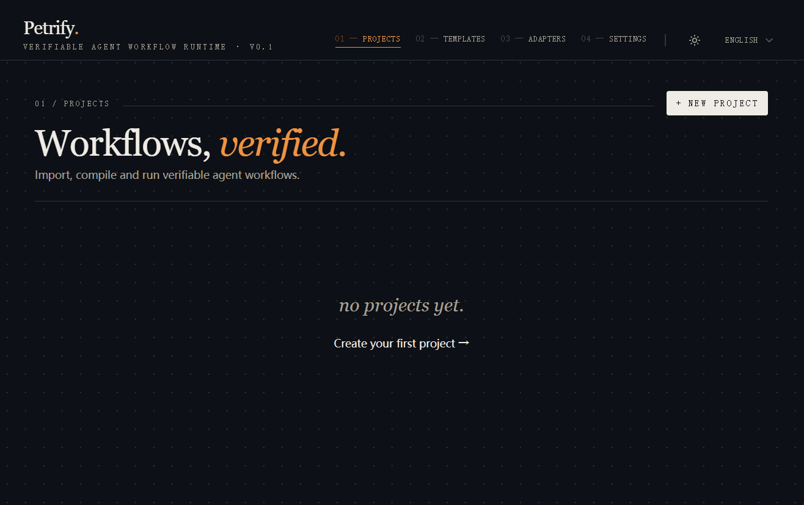
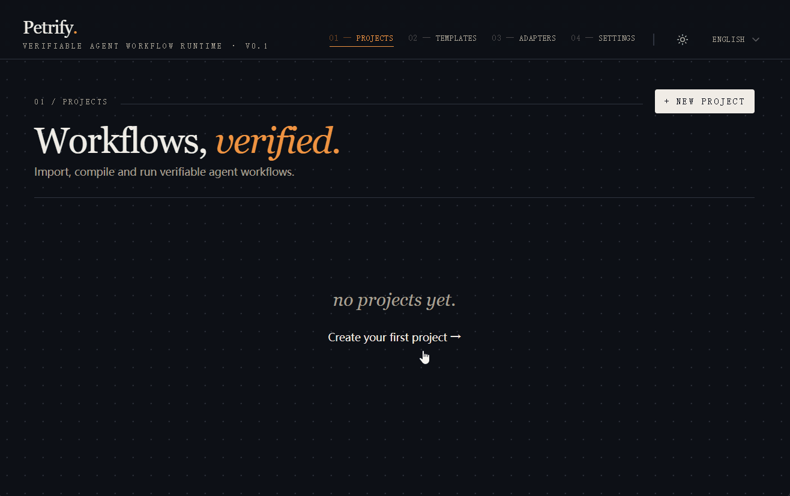
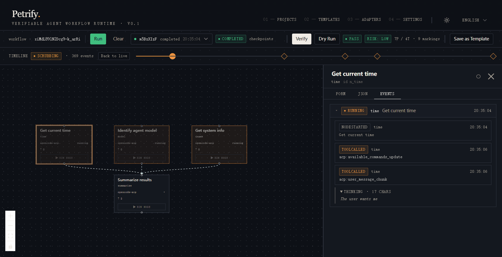

# Petrify

[](https://github.com/ttTennessee/petrify/actions/workflows/ci.yml)
[](./LICENSE)
[](https://nodejs.org)

**Verifiable Agent Workflow Runtime** — orchestrates heterogeneous AI agents through a Petri-net formal model, so workflows are provably correct, not just runnable.

[中文文档](./README.zh.md)

---

## Demo

**Configure an adapter**



**Create a project and run**



**Time Travel replay**



> **Status:** Petrify is in active development and testing. There are no published binaries or Docker images yet — the only supported way to run it is **clone + `pnpm run dev`** (see [Getting Started](#getting-started)). Straightforward workflows work reliably; complex multi-branch / heavy-concurrency scenarios still have rough edges. Feedback and contributions are very welcome.

---

## What is Petrify?

Petrify is a self-hosted runtime that sits **one level above** individual agents (Claude Code, Codex, Cursor, ACP-compatible tools, …). You bring your favorite agents; Petrify schedules and connects them, and verifies the workflow between them.

Every workflow is compiled into a Petri-net and statically checked for **deadlocks, liveness, reachability, boundedness, and termination** before any agent runs. The lifecycle is strict: **Plan → Verify → Execute**.

Petrify is **import-first and model-agnostic** — it does not embed LLM inference. Blueprints arrive as JSON (pasted, imported, or produced by an external LLM). Models only enter execution through a pluggable **AgentAdapter** (ACP, Mock, or custom).

---

## Key Features

- **Formal verification** — Petri-net static analysis catches deadlocks, livelocks, and unbounded loops before runtime
- **Plan → Verify → Execute** lifecycle, enforced by the runtime
- **Pluggable adapters** — ACP, Mock, extensible to `claude-code-cli`, `openai-tools`, or anything custom
- **Checkpoint / Resume / Time Travel** — save state at node boundaries; scrub through execution history
- **Workflow IDE** — React Flow editor with verification panel, event stream, and breakpoint debugger

---

## Getting Started

> Requires Node.js 20+ and pnpm 9+.

```bash
git clone https://github.com/<your-org>/petrify.git
cd petrify
pnpm install
pnpm run dev
```

- Frontend: `http://localhost:5173`
- Backend:  `http://localhost:4000`

Then:

1. Open the frontend, click **New Project** → **Import Blueprint**.
2. Paste any file from `examples/` (e.g. `blog-post-pipeline-en.json`).
3. Click **Verify**, configure an adapter under **Settings → Adapters**, then **Run**.

### ACP Adapter

Configure it via the UI (**Settings → Adapters → Add Adapter**), or boot with an env var:

```bash
PETRIFY_ACP_CMD="opencode acp" pnpm run dev
```

---

## Architecture

```
┌──────────────────────────────────────────────────────┐
│  Web IDE  (React 19 + React Flow + Zustand)          │
│  — DAG editor, verification panel, run controls      │
│  — Event stream, timeline scrubber, breakpoints      │
└───────────────────────┬──────────────────────────────┘
                        │ REST + WebSocket
┌───────────────────────▼──────────────────────────────┐
│  Runtime  (Node.js + Express)                        │
│  Compiler · Scheduler · Verifier                     │
│  Checkpoint Manager · Resource Pools                 │
└───────────────────────┬──────────────────────────────┘
                        │ AgentAdapter interface
           ┌────────────┼────────────┐
       ACP Agent      Mock        (custom)
```

---

## Project Structure

```
petrify/
├── packages/
│   ├── server/    # Node.js runtime: compiler, scheduler, verifier, adapters, REST
│   ├── web/       # React 19 SPA (Vite)
│   └── shared/    # Zod schemas shared by server and web
├── examples/      # Bilingual JSON workflow blueprints
└── CLAUDE.md      # AI-assisted development guidance
```

---

## Development

| Command | Description |
|---------|-------------|
| `pnpm run dev` | Start all packages in watch mode |
| `pnpm run build` | Production build |
| `pnpm run typecheck` | Type-check all packages |
| `pnpm --filter @petrify/server run test` | Backend unit tests |

TypeScript strict mode is enabled across all packages.

---

## Contributing

Read `CLAUDE.md` for product scope and architectural invariants before proposing changes. Open an issue first for anything non-trivial.

## Security

Found a vulnerability? Please **do not** open a public issue — see [SECURITY.md](./SECURITY.md).

## Acknowledgements

Built on [React Flow](https://reactflow.dev/), [shadcn/ui](https://ui.shadcn.com/) + [Radix](https://www.radix-ui.com/), [Tailwind](https://tailwindcss.com/), [Zustand](https://github.com/pmndrs/zustand), [TanStack Query](https://tanstack.com/query), [Express](https://expressjs.com/), [better-sqlite3](https://github.com/WiseLibs/better-sqlite3), [zod](https://zod.dev/), [ws](https://github.com/websockets/ws), [OpenTelemetry](https://opentelemetry.io/), and the [Agent Communication Protocol](https://github.com/agentclientprotocol).

## License

[MIT](./LICENSE) © 2026 Yujie Jin &lt;devilimp0@gmail.com&gt;
